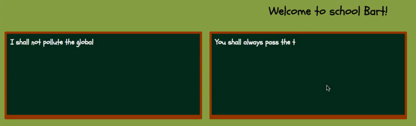

# BartBoard

In this exercise you will create a "BartBoard". It is the blackboard in the Simpson intro that we are trying to create.

It sould work as follows:
When the mouse button is pressed down over the black board a text should appear letter by letter. When the sentence is written once, it should start over once again.

You should be able to have multiple bartboards on the webpage at the same time and they should work independently of each other.

Make sure that the board stops writing when you release the mouse button. We should be able to release the mouse button anywhere on the page.

## Extended features
As a extended feature, try to build the BartBoard as a Custom Element so that you can add it to your page using the tag "&lt;bart-board&gt;". Try to move styles into the custom element by using its shadow dom. 
By doing this you need to be able to tell the surroundings when the board is full using custom events. 

|  |  |
| ------------- | ------------- |
|  Repo | [exercise-bartboard](https://github.com/CS-LNU-Learning-Objects/exercise-bartboard) |
| Level  | A  |
| Keywords| DOM, event, timers, (custom elements, custom events)|
| Solutions | [Recording Part 1 (DOM)](https://youtu.be/jBLruMu5pOs) [Recording Part 2](https://youtu.be/7fAUyQJsOLQ)|
